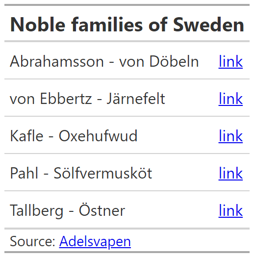
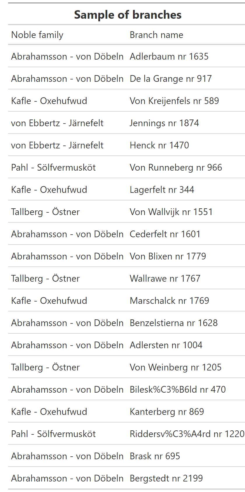

README
================

## Purpose

Scraper of [Adelsvapen](https://www.adelsvapen.com/genealogi/Huvudsida)
genealogy website for noble families of Sweden.

### Planning

This is what the website looks like:


And these are the pages with the information that we want to get,
including:

- Name of the family
- Date of introduction into nobility and extinction
- The first person in the family and their biography
- The biography of their children

Ideally we would want to process this text in such way to keep the
bolded names, and extract birth places and dates.


#### Robots.txt

First we check if they have asked us not to scrape the website.

<blockquote>

robots.txt is a standard used by websites to indicate to visiting web
crawlers and other web robots which portions of the website they are
allowed to visit. This relies on voluntary compliance.

</blockquote>

They have an extensive list of bots they do not allow, but do not forbid
us from scraping the `/genealogi` subsection. So as long as we use a
good wait time between hits so as not to overwhelm their server, we will
be okay!


#### Starting point

We want to get a list of the noble families and a link to their family
trees, as shown in the table below:



Next we want to scrape the links to the branches of family trees for
each family. They look like this:


Ideally we would loop through the list and keep a record of each branch
of the family tree with a link to it.

``` r
# let's write a function to do this

library(rvest)

get_branches <- function(url_in) {
  message("Getting branches of family tree from: ", url_in)
  Sys.sleep(5)
  html <- read_html(url_in)

  family_links <- html %>%
    html_nodes("a") %>%
    html_attr("href")

  family_links_filtered <- family_links %>%
    as_tibble() %>%
    rename(branch_url = value) %>%
    # get family links that contain a /genealogi beginning and a number
    filter(
      str_detect(branch_url, "/genealogi/.+\\d"),
      !str_detect(branch_url, "Adelsvapen-Wiki"),
      !str_detect(branch_url, "Special:")
    )
  
  return(family_links_filtered)
}

noble_families_branches <- noble_families %>% 
  mutate(branches = map(url, possibly(get_branches, "failed")))

noble_families_branches %>% 
  unnest(branches) %>% 
  write_rds(here::here("links", "family_links.rds"))
```

So now we have a link to each of the 2,335 branches of the family trees.

A sample of these is shown below in a table



``` r
url_in = "https://www.adelsvapen.com/genealogi/Abrahamsson_nr_1817"

get_info_from_family <- function(url_in) {
  html <- read_html(url_in)

  fam_abb <- str_remove(url_in, "https://www.adelsvapen.com/genealogi/")

  title <- html %>%
    html_nodes(".title") %>%
    html_text()

  bio <- html %>%
    html_nodes("p") %>%
    html_text() %>%
    str_squish() %>%
    as_tibble() %>%
    rename(info = value) %>%
    filter(str_detect(info, "\\d\\d\\d\\d")) %>%
    nest(bio = everything())

  children <- html %>%
    html_nodes("ul") %>%
    html_text() %>%
    str_squish() %>%
    as_tibble() %>%
    rename(children_bio = value) %>%
    filter(str_detect(children_bio, "född")) %>%
    nest(children = everything())

  # image
  img_src <- html %>%
    html_node(".image") %>%
    html_elements("img") %>%
    html_attr("src")

  img_url <- img_src %>% str_c("https://www.adelsvapen.com", .)

  download.file(img_url, destfile = here::here(glue::glue("scraped_images/{fam_abb}.jpg")), mode = "wb")

  return(tibble(title, bio, children))
}

data <- get_info_from_family(url_in)

data %>% 
  write_rds(here::here("temp", "Abrahamsson.rds"))

data <- read_rds(here::here("temp", "Abrahamsson.rds"))

data %>%
  unnest(bio) %>%
  unnest(children) %>%
  pivot_longer(everything(), names_to = "Section", values_to = "Text") %>%
  mutate(Section = str_to_title(str_replace(Section, "_", " "))) %>%
  arrange(desc(Section)) %>%
  distinct() %>%
  group_by(Section) %>%
  gt() %>%
  tab_style(
    style = list(
      cell_fill(color = "#191970"),
      cell_text(color = "white")
    ),
    locations = cells_row_groups(groups = everything())
  ) %>%
  tab_header(title = md("**Example of data on individual family branches**")) %>%
  tab_footnote(md("Source: [Adelsvapen](https://www.adelsvapen.com/genealogi/Abrahamsson_nr_1817)")) %>% 
  gtsave(here::here("temp", "Abrahamsson_info.png"))
```


We can also include the family crest:


